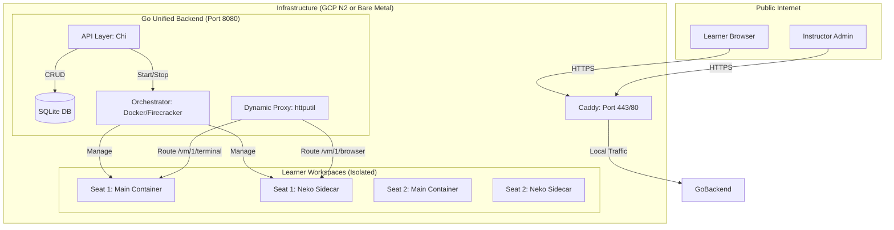

# ClaraTeach - Architecture Overview

## System Architecture

ClaraTeach has evolved into a **Unified Backend** architecture. A single Go service handles the Control Plane (API, Database), the Orchestration (Docker/MicroVMs), and the Data Plane (Dynamic Proxying).

---

## Component Details

### 1. Unified Go Backend (`backend/`)

The core of the system is a single Go binary that provides several internal services:

#### A. API Layer (`internal/api/`)
Handles all RESTful requests from the React frontend.
- **Workshop CRUD:** Create, List, Delete workshops.
- **Join Logic:** Handles learner entry, seat allocation, and session reconnection.
- **Synchronous Provisioning:** When a workshop is created, the API blocks until all containers are fully ready.

#### B. Store Layer (`internal/store/`)
- **Persistence:** Uses **SQLite** to store workshop metadata and seat assignments.
- **Resilience:** Unlike previous in-memory versions, data persists across backend restarts.
- **Schema:** Tracks workshop status and detailed session state (provisioning, ready, occupied).

#### C. Orchestrator Layer (`internal/orchestrator/`)
Manages the lifecycle of learner environments.
- **Docker Provider (Current):** Uses the native Docker SDK to spin up pairs of containers (Workspace + Neko) for every seat.
- **Firecracker Provider (Planned):** Interface-ready for hardware-isolated MicroVMs on supported Linux hosts.
- **Isolation:** Automatically creates a dedicated Docker bridge network per workshop.

#### D. Dynamic Proxy Layer (`internal/proxy/`)
Acts as the intelligent gateway to learner containers.
- **URL-based Routing:** Identifies the target workshop and seat based on the subdomain or path.
- **Service Detection:** Automatically routes traffic to Port 3001 (Terminal), 3002 (Files), or 3003 (Browser Sidecar) depending on the request path.
- **WebSocket Support:** Robustly handles proxied WebSocket connections for the terminal.

### 2. Frontend (`frontend/`)
A modern React application built with Vite and TypeScript.
- **Instructor Dashboard:** Management interface for creating workshops.
- **Join Flow:** Simple, code-based entry for learners.
- **Workspace UI:** A polished, VS Code-like interface featuring an integrated Terminal, Monaco Editor, and Browser Preview.

### 3. Workspace (`workspace/`)
The code and configuration that runs **inside** each learner's container.
- **Workspace Server:** A Node.js/Fastify service providing the Terminal (PTY) and File System APIs.
- **Neko Sidecar:** An isolated Firefox instance streamed via WebRTC for browser previews.

---

## Data Flow

### Workshop Creation & Provisioning
1. Instructor submits `POST /api/workshops`.
2. Backend creates a DB record and a dedicated network.
3. Backend **synchronously** spins up $N$ seats (each seat = Workspace container + Neko container).
4. Backend verifies each container has an IP and is healthy.
5. Success response returned to Instructor.

### Learner Join & Connection
1. Learner enters a join code at `/join`.
2. Frontend calls `POST /api/join`.
3. Backend finds an available pre-provisioned seat, marks it `occupied`, and assigns the user's name.
4. Backend returns a JWT and an **Endpoint URL** (e.g., `https://ws-abc.clarateach.io`).
5. Frontend connects its components to that Endpoint.
6. The Backend **Proxy** intercepts the requests and tunnels them to the correct container IP.

---

## Security Model

### 1. Isolation Layers
- **Network:** Each workshop is on a private Docker bridge. Inter-workshop communication is blocked.
- **Runtime:** Learner code runs as a non-root user (`learner`) inside the container.
- **Future (Firecracker):** Transitioning to KVM-based MicroVMs to provide a hardware-level security boundary between learners.

### 2. Authentication
- **JWT:** All requests to workspace APIs (Terminal/Files) require a signed JWT token.
- **Seat Enforcement:** The backend verifies that the token's seat assignment matches the URL path being accessed.

---

## Networking Model (Local vs Prod)

| Feature | Local Development | Production (Cloud) |
|---------|-------------------|-------------------|
| **Primary Domain** | `localhost:8080` | `api.clarateach.io` |
| **Workspace Routing** | `/debug/proxy/{ws_id}/vm/{seat}` | `{ws_id}.clarateach.io/vm/{seat}` |
| **Proxy Implementation**| Internal Go `httputil` | Caddy (SSL) -> Go `httputil` |
| **Docker Socket** | Autodetected (Colima/Docker Desktop) | Standard `/var/run/docker.sock` |

---

## Performance Expectations

- **Workshop Boot (10 seats):** ~5-10 seconds (Synchronous).
- **Learner Join:** < 100ms (Pre-provisioned).
- **Terminal Latency:** Negligible (Direct proxying).
- **Memory Overhead:** ~150MB per seat (Workspace + Neko).